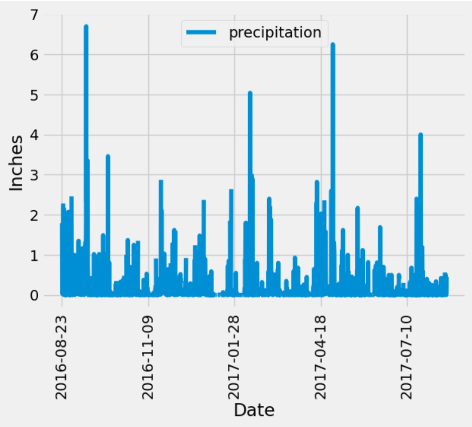

## Data Analysis and Exploration SQLAlchemy

In this project, I conducted a climate analysis and data exploration of the Honolulu, Hawaii area using Python, SQLAlchemy, Pandas, and Matplotlib. The following steps outline the process:

1. **Connecting to the SQLite Database:** I used the SQLAlchemy `create_engine()` function to establish a connection with the provided SQLite database.

2. **Reflecting Tables:** Using the SQLAlchemy `automap_base()` function, I reflected the tables from the database into classes, namely `station` and `measurement`.

3. **Creating a Session:** To interact with the database, I created a SQLAlchemy session.

4. **Precipitation Analysis:** I performed an analysis of precipitation data by following these steps:
   - Finding the most recent date in the dataset.
   - Retrieving the previous 12 months of precipitation data starting from that date.
   - Loading the query results into a Pandas DataFrame and sorting them by date.
   - Plotting the results using the DataFrame plot method.
   - Printing the summary statistics for the precipitation data.
  
5. **Station Analysis:** I conducted an analysis of the stations by following these steps:
   - Designing a query to calculate the total number of stations in the dataset.
   - Listing the stations and their observation counts in descending order.
   - Determining the station with the highest number of observations.
   - Designing a query to calculate the lowest, highest, and average temperatures for the most-active station.
   - Querying the previous 12 months of temperature observation (TOBS) data for that station.
   - Plotting the results as a histogram.

## Designing the Climate App

In the second part of the project, I designed a Flask API based on the queries developed in the previous steps. The API consists of the following routes:

- `/`: The homepage that lists all available routes.
- `/api/v1.0/precipitation`: Retrieves the last 12 months of precipitation data as a JSON dictionary.
- `/api/v1.0/stations`: Returns a JSON list of stations from the dataset.
- `/api/v1.0/tobs`: Retrieves the previous year's temperature observations for the most-active station as a JSON list.
- `/api/v1.0/<start>` and `/api/v1.0/<start>/<end>`: Returns JSON lists of the minimum temperature, average temperature, and maximum temperature for a specified start date or start-end date range.

